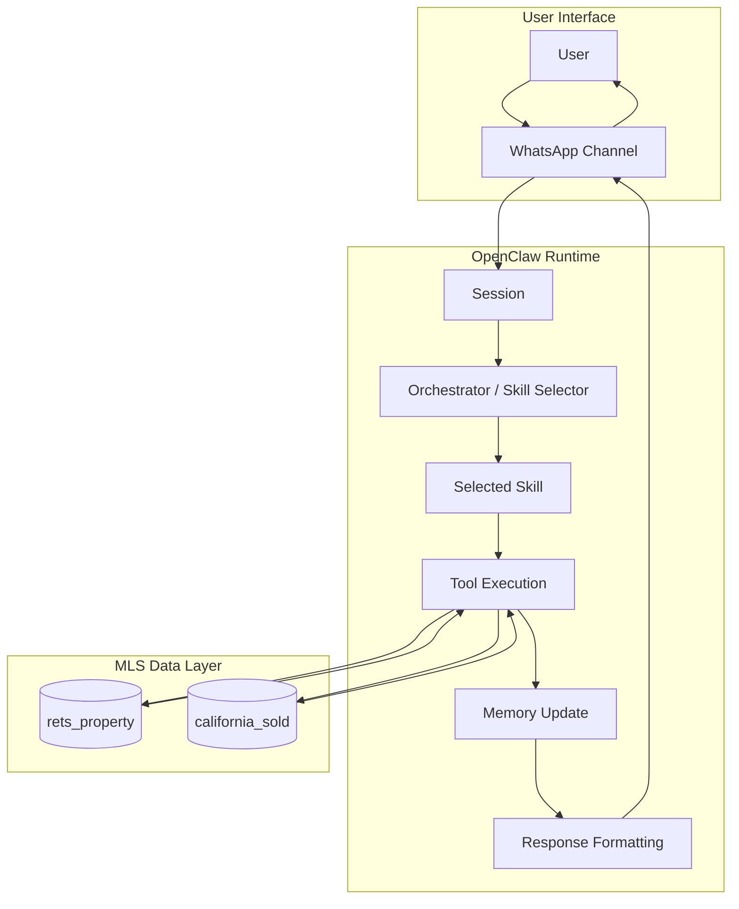

# Week 1 - OpenClaw Architecture Fundamentals

## Objective

The goal of Week 1 is to understand the basic architecture of OpenClaw and how its main components work together.

OpenClaw is a multi-agent orchestration runtime that manages:

- skill routing
- session state
- channel integration
- tool execution
- memory
- agent orchestration

This architecture will be the foundation for the later weeks of the internship.

---

## Architecture Flow

The basic flow of a user request is:

User  
→ WhatsApp  
→ OpenClaw Runtime  
→ Skill Selector / Orchestrator  
→ Tool Execution  
→ Memory Update  
→ Response  
→ User

In this internship, tools will eventually connect to the MLS databases:

- `rets_property`
- `california_sold`

---

## Core Components

### 1. Channels

Channels are the communication interfaces between the user and OpenClaw.

Examples:

- WhatsApp
- Email
- Web

For this internship, WhatsApp is the main communication channel.

A user sends a message through WhatsApp, and OpenClaw receives and processes that message.

---

### 2. Sessions

A session stores the state of a conversation for a specific user.

For example, if a user first asks:

"Show me homes in Irvine"

and then asks:

"Only show ones under $1.2 million"

the session allows the system to remember that the user is still talking about homes in Irvine.

Sessions make multi-turn conversations possible.

---

### 3. Skills

Skills are modular capabilities that perform a specific type of task.

Examples that will be used later in this internship include:

- property search
- market statistics
- recommendation
- RAG / knowledge retrieval

A skill is selected depending on what the user is asking for.

---

### 4. Tools

Tools are functions that perform actual operations for the agent.

Examples:

- query a MySQL database
- get current time
- search property listings
- calculate market statistics

A tool performs the concrete work after the system decides what needs to be done.

---

### 5. Memory

Memory stores information that can be used later in a conversation or across interactions.

The handbook describes two general types:

- short-term session state
- long-term vector storage

Short-term memory helps the agent remember the current conversation.

Long-term memory can later be used for semantic search and retrieval.

---

### 6. Orchestrator

The orchestrator decides which skill or agent should handle a user's request.

For example:

User asks:

"Show me condos in Irvine under $1.5M."

The orchestrator may determine that this is a property-search request and route it to a property-search skill.

Later in the internship, a request may require multiple agents or skills.

---

## MLS Databases

### rets_property

`rets_property` contains active MLS property listings.

It will be used for tasks such as:

- property search
- filtering by city
- filtering by price
- bedrooms and bathrooms
- property type
- pool or view
- property recommendations

---

### california_sold

`california_sold` contains historical sold-property data.

It will later be used for tasks such as:

- comparable sales
- market analytics
- price trends
- recommendation validation

---

## Example Query Flow

Example user request:

"Show me 3-bedroom homes in Irvine under $1.5M."

Possible flow:

1. The user sends the message through WhatsApp.
2. The WhatsApp channel sends the message to the OpenClaw runtime.
3. OpenClaw identifies the user's session.
4. The orchestrator analyzes the request.
5. The property-search skill is selected.
6. The skill calls a database tool.
7. The tool queries the `rets_property` table.
8. MySQL returns matching listings.
9. OpenClaw formats the results.
10. Session or memory state may be updated.
11. The response is sent back through WhatsApp.
12. The user receives the property results.

---

## Architecture Diagram

